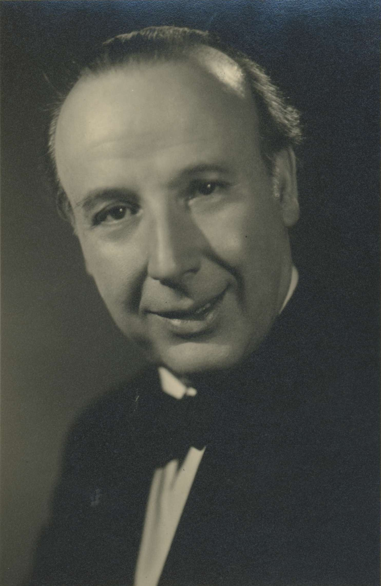

# Emilio Pujol's 17 variations on an exercise by Dionisio Aguado

### Their place in the four-volume "Escuela Razonada de la Guitarra" and the teacher/author/composer/performer's body of work

**By Steven Rosenberg**
 *classical_guitar@passthejoe.net*

<table width="200" border="1" cellpadding="5" hspace="20" align=right>

<tr>

<td align="center" valign="center">

 
Emilio Pujol
</td>

</table>

Volume 4 of Emilio Pujol's "Escuela Razonada de la Guitarra" — called *el cuatro libro* in Pujol's *prefecio* to the Spanish/French edition of his detailed 20th century guitar method — is less well-known in the English-speaking world because it was not part of the three-volume Editions Orphée English translation known as "Guitar School."

But Volume 4 is full of technical exercises and instructions, rendered in Spanish and French, of course. As with volumes 2 and 3, *libro quartro* ends with a number of studies. Meant to reinforce various aspects of classical guitar technique, these selections are very musical — and surprisingly modern at times.

While *el segundo libro* and *el tercero libro* both contain studies grouped together at the end of their respective volumes, Pujol makes a departure in *el cuatro libro*, tying a number of *estudios* together in the form of a theme and variations.

Volume 4 offers the short Exercise 19 from the influential guitar method by 19th-century giant Dionisio Aguado and follows it with *Estudios* LIV through LXX — 17 variations composed by Pujol. Each variation focuses on different guitar techniques while at the same time venturing into harmonic territory that is very much of Pujol's time, the later Romantic and early modern periods of classical music.

In this essay I will attempt to place the Aguado exercise and the Pujol variations into some kind of context within the *canon* of guitar methods, running from those of Fernando Sor, Aguado and Matteo Carcassi, through Pujol's own comprehensive yet overlooked four-volume method.

Looming over the literature and performance of the classical guitar in the late 19th century into the 20th were several prominent figures, including Francisco Tárrega, who nearly single-handedly dragged the guitar into the Romantic period through his teaching, compositions and transcriptions. Tárrega is regarded as the modern father of the guitar. The *School of Tárrega*, as his unwritten method and the followers of it are known, provided the inspiration — always prominently credited — for the methods written by Pujol, Pascual Roch and Julio Sagreras.

The other giant of the classical guitar, Andres Segovia, who took the instrument to heights no one had reached before or since, praises Tárrega as a father of the modern guitar, but hews to the Segovia origin story of being almost entirely self-taught.

As bona fide students of Tárrega, guitarists Miguel Llobet and Pujol toured the world, but neither maintained the performance schedule and relentless ability to promote himself and his instrument that characterized Segovia during his long career.

Segovia commissioned hundreds of original works for the guitar, composed a few of his own, and issued a decent number of editions of works by famous composers, many of which consist of studies and etudes. Yet aside from his famous (and famously short) editions of major and minor scales and slur studies, Segovia never put together his own guitar method.

These chapters/essays are part of the project:

[Emilio Pujol's 'Escuela Razonada de La Guitarra,' 4 volumes in Spanish and French](/escuela_razonda_de_la_guitarra.md)

[Pujol's 'Guitar School,' 3 volumes in English](/guitar_school.md)

[The Aguado study and 17 variations](/aguado_study_and_17_variations.md)

[Volume 4 of Pujol's 'Escuela Razonada de La Guitarra'](/volume_4.md)

**Upcoming:**

Emilio Pujol Vilarrubí

Francisco Tárrega

Miguel Llobet Solés

Antonio de Torres Jurado

Ronald Purcell

*This work is available via GitHub [under a Creative Commons license](/LICENSE.md) that precludes republishing without attribution and for commercial use.* 

*If you would like me to write something for publication, contact me at classical_guitar@passthejoe.net.*
